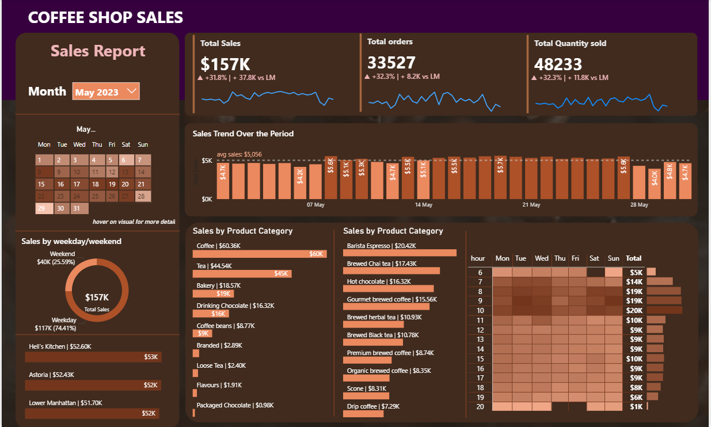

# ☕ Coffee Shop Sales Dashboard

## 📌 Project Overview
This project analyzes **coffee shop sales data** using SQL for data preparation and **Power BI** for visualization.  
The dashboard provides insights into sales trends, product categories, and performance comparisons across time.

---
## 📊 Dashboard Preview  

Here is the Coffee Shop Sales Dashboard built in Power BI:  

## 🗂️ Data Source
- Coffee shop transaction dataset containing:
  - `transaction_id`
  - `transaction_date`
  - `transaction_time`
  - `product_category`
  - `product_name`
  - `transaction_qty`
  - `unit_price`
  - `store_location`

---

## 🛠️ Tools Used
- **SQL (MySQL)** → for data extraction, cleaning, and aggregation.  
- **Power BI** → for creating interactive reports and dashboards.  

---

